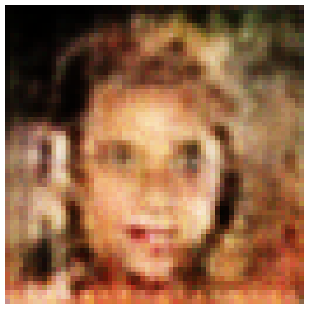
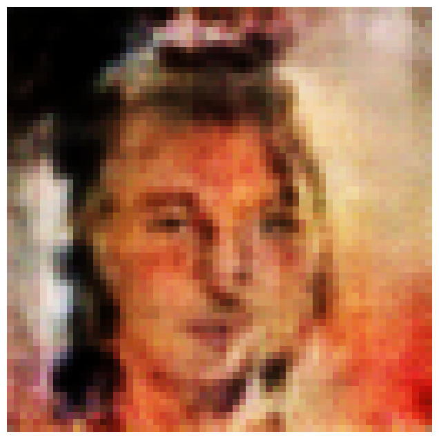
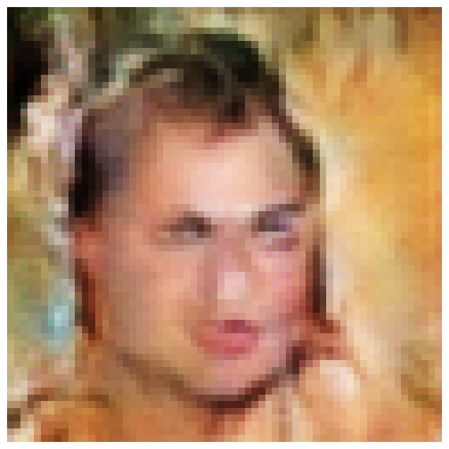
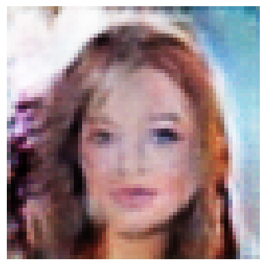

# DCGAN on CelebA Dataset 🎭

This project implements a **Deep Convolutional Generative Adversarial Network (DCGAN)** to generate human faces using the **CelebA dataset**. 

---

## 📂 Dataset Preprocessing

### **1️⃣ Download the Dataset**
The CelebA dataset can be downloaded from Kaggle:

#IMPORTING Celeba DATASET from kaggle 

import kagglehub


path = kagglehub.dataset_download("jessicali9530/celeba-dataset")

print("Path to dataset files:", path)


- **Resize images** to `64x64 pixels` (DCGAN standard size)  
- **Normalize pixel values** to `[-1,1]` for better GAN training  
- **Use PyTorch's `ImageFolder` to load dataset**  
- **Use a subset of 5000 images to reduce the training time.**  

## **⚠️ Note: If you have processing power, use the full dataset for training your model!**


```python
import torch
import torchvision.transforms as transforms
import torchvision.datasets as datasets
from torch.utils.data import DataLoader, Subset

# Define transformations based on the DCGAN paper
transform = transforms.Compose([
    transforms.Resize(64),  # Resize to 64x64
    transforms.CenterCrop(64),  # Crop the center
    transforms.ToTensor(),  # Convert to tensor
    transforms.Normalize([0.5], [0.5])  # Normalize to [-1, 1]
])

# Load the CelebA dataset
dataset = datasets.ImageFolder(root="/root/.cache/kagglehub/datasets/jessicali9530/celeba-dataset/versions/2/img_align_celeba", transform=transform)

# Limit dataset to first 5000 images
subset_indices = list(range(5000))  # Select the first 5000 images
small_dataset = Subset(dataset, subset_indices)  # Create subset

# Create a new DataLoader for the smaller dataset
dataloader = DataLoader(small_dataset, batch_size=128, shuffle=True)

# Check the dataset
real_batch = next(iter(dataloader))
print("Batch shape:", real_batch[0].shape)  # Expected: (batch_size, 3, 64, 64)
print(f"Total images in dataloader: {len(small_dataset)}")  # Should print 5000
```

---

## 🚀 Training the DCGAN Model

### **1️⃣ Create the Generator**
```python
import torch.nn as nn

class Generator(nn.Module):
    def __init__(self):
        super(Generator, self).__init__()
        self.main = nn.Sequential(
            # Input: latent vector z (100,)
            nn.ConvTranspose2d(100, 512, 4, 1, 0, bias=False),
            nn.BatchNorm2d(512),
            nn.ReLU(True),

            nn.ConvTranspose2d(512, 256, 4, 2, 1, bias=False),
            nn.BatchNorm2d(256),
            nn.ReLU(True),

            nn.ConvTranspose2d(256, 128, 4, 2, 1, bias=False),
            nn.BatchNorm2d(128),
            nn.ReLU(True),

            nn.ConvTranspose2d(128, 64, 4, 2, 1, bias=False),
            nn.BatchNorm2d(64),
            nn.ReLU(True),

            nn.ConvTranspose2d(64, 3, 4, 2, 1, bias=False),
            nn.Tanh()  # Output in range [-1, 1]
        )

    def forward(self, x):
        return self.main(x)
```
### **2️⃣ Create the Discriminator**
```python
class Discriminator(nn.Module):
    def __init__(self):
        super(Discriminator, self).__init__()
        self.main = nn.Sequential(
            nn.Conv2d(3, 64, 4, 2, 1, bias=False),
            nn.LeakyReLU(0.2, inplace=True),

            nn.Conv2d(64, 128, 4, 2, 1, bias=False),
            nn.BatchNorm2d(128),
            nn.LeakyReLU(0.2, inplace=True),

            nn.Conv2d(128, 256, 4, 2, 1, bias=False),
            nn.BatchNorm2d(256),
            nn.LeakyReLU(0.2, inplace=True),

            nn.Conv2d(256, 512, 4, 2, 1, bias=False),
            nn.BatchNorm2d(512),
            nn.LeakyReLU(0.2, inplace=True),

            nn.Conv2d(512, 1, 4, 1, 0, bias=False),
            nn.Sigmoid()  # Output: Probability of real vs. fake
        )

    def forward(self, x):
        return self.main(x)
```
### **3️⃣ Create the optimizer and loss function**
```python
import torch.optim as optim

# Initialize models
device = torch.device("cuda" if torch.cuda.is_available() else "cpu")
netG = Generator().to(device)
netD = Discriminator().to(device)

# Loss function
criterion = nn.BCELoss()

# Optimizers (following the DCGAN paper)
lr = 0.0002
beta1 = 0.5
optimizerD = optim.Adam(netD.parameters(), lr=lr, betas=(beta1, 0.999))
optimizerG = optim.Adam(netG.parameters(), lr=lr, betas=(beta1, 0.999))
```
### **4️⃣ Call the function to start training the model**
```python
import numpy as np
import matplotlib.pyplot as plt

num_epochs = 50
fixed_noise = torch.randn(64, 100, 1, 1, device=device)  # Fixed noise for monitoring progress

for epoch in range(num_epochs):
    for i, (real_images, _) in enumerate(dataloader):
        # Move real images to device
        real_images = real_images.to(device)
        batch_size = real_images.size(0)

        ## Train Discriminator ##
        netD.zero_grad()
        labels_real = torch.ones(batch_size, 1, device=device)  # Real labels = 1
        labels_fake = torch.zeros(batch_size, 1, device=device) # Fake labels = 0

        labels_real = torch.ones(batch_size, device=device).view(-1)  # Shape: (batch_size,)
        labels_fake = torch.zeros(batch_size, device=device).view(-1)  # Shape: (batch_size,)


        output_real = netD(real_images).view(-1)
        lossD_real = criterion(output_real, labels_real)

        noise = torch.randn(batch_size, 100, 1, 1, device=device)
        fake_images = netG(noise)
        output_fake = netD(fake_images.detach()).view(-1)
        lossD_fake = criterion(output_fake, labels_fake)

        lossD = lossD_real + lossD_fake
        lossD.backward()
        optimizerD.step()

        ## Train Generator ##
        netG.zero_grad()
        labels_gen = torch.ones(batch_size, 1, device=device)  # Trick discriminator
        output_fake_G = netD(fake_images).view(-1)

        labels_gen = torch.ones(batch_size, 1, device=device)  # Shape: (128, 1)
        output_fake_G = netD(fake_images).view(-1, 1)  # Reshape to (128, 1)


        lossG = criterion(output_fake_G, labels_gen)

        lossG.backward()
        optimizerG.step()

    # Print loss after each epoch
    print(f"Epoch [{epoch+1}/{num_epochs}], Loss D: {lossD.item()}, Loss G: {lossG.item()}")

    # Save and visualize generated images
    if (epoch+1) % 5 == 0:
        with torch.no_grad():
            fake_images_fixed = netG(fixed_noise).detach().cpu()
        plt.figure(figsize=(8, 8))
        plt.axis("off")
        plt.imshow(np.transpose(fake_images_fixed[0], (1, 2, 0)) * 0.5 + 0.5)
        plt.show()
```


The model is trained using **Binary Cross-Entropy Loss (BCELoss)** and the **Adam optimizer** with:
- Learning rate: `0.0002`
- Momentum: `β1 = 0.5`

### **5️⃣ Save the Model**
```python
torch.save(netG.state_dict(), "dcgan_celeba_generator.pth")
torch.save(netD.state_dict(), "dcgan_celeba_discriminator.pth")
```

---

## 🧪 Testing the Model (Generate New Images)
After training, you can generate new images using the trained **Generator**:

```python
netG.load_state_dict(torch.load("dcgan_celeba_generator.pth"))
netG.eval()

noise = torch.randn(1, 100, 1, 1, device=device)
generated_face = netG(noise).detach().cpu()

plt.imshow(np.transpose(generated_face[0], (1, 2, 0)) * 0.5 + 0.5)
plt.axis("off")
plt.show()
```

---

## 🎨 Expected Outputs
After training for several epochs, the **generated faces** should look realistic. Initially, they may appear noisy, but over time, they improve in quality.

| **Epoch 0** | **Epoch 10** | **Epoch 50** |
|-----------|------------|------------|
|  |  |  |

*Note: The more epochs, the better the image quality.*

## 🎨 Generated Output Image



---

## 🏆 Next Steps
- Tune **hyperparameters** for better results.
- Use the full dataset or more images to train for a better quality output.
- Train for **more epochs** to improve image quality.
- Use **FID Score** to measure image realism.


